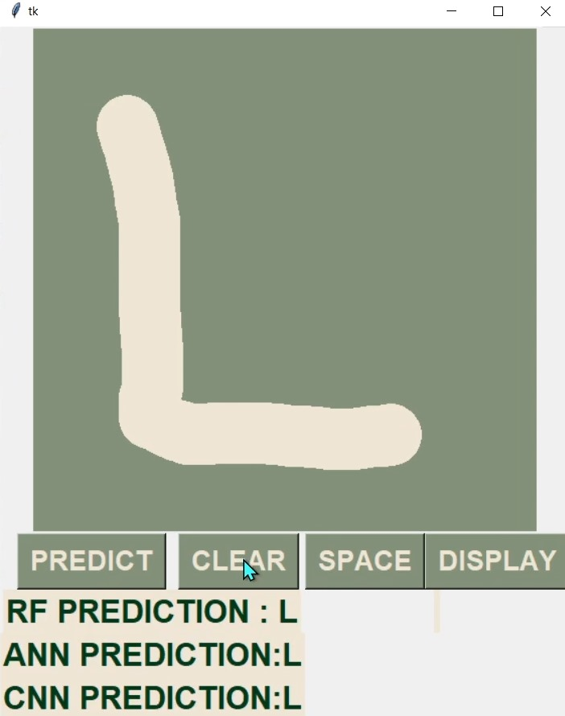
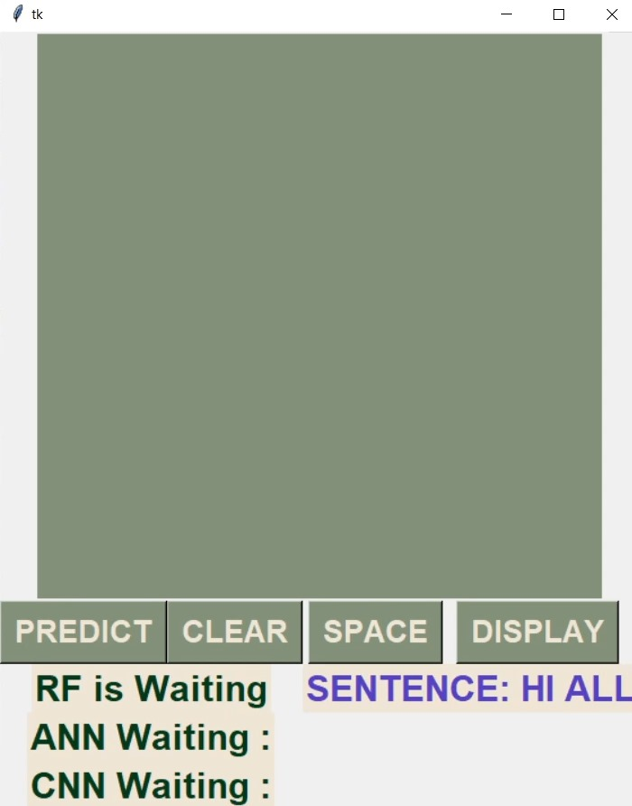

# Handwritten-English-Character-Recognition-
This project aims to build and compare three different machine learning models for handwritten character recognition: Random Forest, Artificial Neural Network (ANN), and Convolutional Neural Network (CNN). The models are trained on the EMNIST Balanced dataset, which is a balanced version of the EMNIST dataset with an equal number of samples per class.

## Table of Contents

1. Dataset
2. Models
3. Installation
4. Usage
5. Results
6. Contributing

### Dataset
The project uses the EMNIST Balanced dataset, which consists of the following:

Train set: 112,800 samples
Test set: 18,800 samples
Total: 131,600 samples
Classes: 47 (balanced)

The dataset includes images of handwritten characters, including letters (uppercase and lowercase) and digits.

### Models
The project implements three different machine learning models for handwritten character recognition:

* **Random Forest (RF)**: An ensemble learning method that constructs multiple decision trees and combines their outputs for prediction.
* **Artificial Neural Network (ANN)**: A feed-forward neural network with several dense layers and ReLU activation functions.
* **Convolutional Neural Network (CNN)**: A deep learning model designed for image processing tasks, featuring convolution, pooling, and fully connected layers.

### Installation

Clone the repository:
Copy codegit clone https://github.com/KonouzA/Handwritten-English-Character-Recognition-.git

Install the required dependencies:
Copy codepip install -r requirements.txt

### Usage

Prepare the dataset by downloading the EMNIST Balanced dataset (the training set has not been included due to its large size, you can download it here: [EMNIST Dataset]([url](https://www.kaggle.com/datasets/crawford/emnist))) and placing the files in the appropriate directory.
Run the GUI&MODELS.py script to train and evaluate the models:
Copy codepython GUI&MODELS.py

The script will preprocess the data, train the models, and display the results, including accuracy scores and predictions.
You can also use the provided graphical user interface (GUI) to draw characters and obtain predictions from the trained models.

### Results
The project includes an analysis of the performance of each model on the test set, along with visualizations and evaluation metrics. 

### Contributing
This was a group project made with my wonderful colleagues: Yara Masoed, Omar Ayman, Retaj, and Nada.
